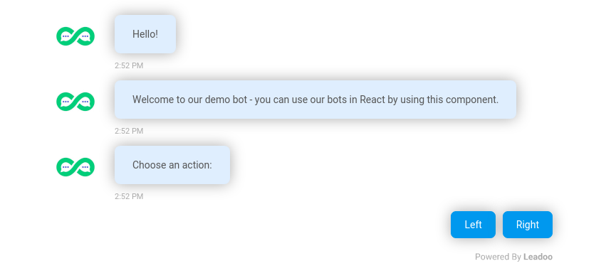

# React Bots
> React components for Leadoo bots

[](https://travis-ci.org/LeadooMT/react-bot)



This UI library provides components and helpers for using [Leadoo](https://leadoo.com/) bots within React environments.

> Please note that to use these bot components, you need to have a [Leadoo account](https://leadoo.com/get-leadoo/).

## About

Leadoo bots are complex JavaScript applications that render complex UI element trees, and they are usually not directly usable within _reactive_ environments such as React. React can update the DOM, removing and moving elements around, many times a second (in extreme cases). Doing so with a Leadoo bot inside could result in large amounts of errors and memory overflow - but this library is designed to handle that.

These React components wrap Leadoo bots and handle all the cleanup and mount/dismount preparation for you.

> Please note that destroying and recreating bot components regularly should be considered an anti-pattern. Do not place bot components in areas or subtrees that are regularly re-rendered.

### Bot Types

Currently **In-Page** (`InPageBot`) and **Visual** (`VisualBot`) bots are supported. These bots are containers that can be placed in content areas.

### Compatibility

These components are designed for the latest version of React, at least version `18.2`.

The bots used within these components follow internal bot generation configurations - please see your Leadoo contact regarding the version of your bot before using this toolkit.

**Important**: The bots in this library are built using [ESM](https://gist.github.com/sindresorhus/a39789f98801d908bbc7ff3ecc99d99c) - They will only work within other ESM environments, or projects with a compatible build phase (Webpack/Rollup etc.). CommonJS exports are no longer supported.

## Usage

Install by running the following:

```shell
npm install @leadoo/react-bot --save-dev
```

You can import separate bot components to use in your website:

```tsx
import { InPageBot } from "@leadoo/react-bot";

export function MyComponent() {
    return (
        <div>
            <InPageBot code="abc123" />
        </div>
    );
}
```

### Development

Once cloned, execute `npm install` in the root of this project using at least NodeJS version 10.

You can develop on this repository, having the files watched for changes, by running `npm run dev`. To build a production copy in the `dist` directory, run `npm run build`. You can run the tests by executing `npm test`.

When **publishing**, make sure to use the `np` module, installed globally. Make sure to update the `CHANGELOG.md` file beforehand with your changes.

To **preview** the components in this repository, run `npm run storybook` to open the component stories in your browser.

## API

### InPageBot

In-Page bot wrapper. Import using `{ InPageBot }`.

Properties:

| Property          | Required  | Default   | Description                           |
|-------------------|-----------|-----------|---------------------------------------|
| `code`            | Yes       | _None_    | The bot code (provided by Leadoo).    |
| `mediaPartner`    |           | _None_    | Optional Media Partner identifier. Enables Media Partner mode. |
| `seamless`        |           | `true`    | Whether to run in **seamless** mode or not. |

Usage is straightforward - import the `InPageBot` component and place it in your application using a bot `code`:

```tsx
import { InPageBot } from "@leadoo/react-bot";

const BOT_CODE = "xyz123";

export function MyApp() {
    return (
        <div>
            <InPageBot code={BOT_CODE} seamless={false} />
        </div>
    );
}
```

When using a Media Partner configuration, set the `mediaPartner` property to the Media Partner identifier used in your system:

```tsx
import { InPageBot } from "@leadoo/react-bot";

const MEDIA_PARTNER = "MyCompany";

function getSectionCode(): string {
    return /^\/blog/.test(window.location.pathname)
        ? "blog"
        : "main";
}

export function MyApp() {
    return (
        <div>
            <InPageBot
                code={getSectionCode()}
                mediaPartner={MEDIA_PARTNER}
            />
        </div>
    );
}
```

Make sure to read the [Media Partner concept description](#media-partner).

### VisualBot

Visual bot wrapper. Import using `{ VisualBot }`.

Properties:

| Property          | Required  | Default   | Description                           |
|-------------------|-----------|-----------|---------------------------------------|
| `code`            | Yes       | _None_    | The bot code (provided by Leadoo).    |
| `seamless`        |           | `false`   | Whether to run in **seamless** mode or not. |

Usage is straightforward - import the `VisualBot` component and place it in your application using a bot `code`:

```tsx
import { VisualBot } from "@leadoo/react-bot";

const BOT_CODE = "xyz123";

export function MyApp() {
    return (
        <div>
            <VisualBot code={BOT_CODE} seamless />
        </div>
    );
}
```

## Concepts

### Seamless mode

Seamless mode allows the bot to continue expanding, vertically, as content appears within it. This is not the default mode of operation, which is to lock at a certain height and use a scroll-bar to continue viewing content within the bot.

Seamless mode can appear more natural in certain scenarios, as more of the bot content is visible to the user.

### Media Partner

The Media Partner configuration is a subset of functionality available for configuring **In-Page** bots so that they're installation and configuration are handled separately, at different times, and possibly by different teams at a company.

Using a Media Partner setup, bots can be placed on a page using dynamic codes which can be _later_ tied to an actual bot set-up through the UI. Bot scripts that run and do not find an associated bot on that account simply do nothing.
